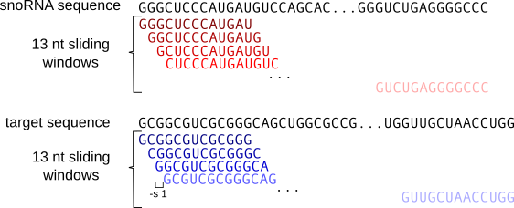
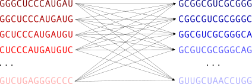
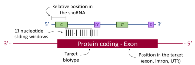

# snoGloBe manual

snoGlobe uses a gradient boosting classifier to predict human box C/D snoRNA interactions using sequence and position 
information from both snoRNA and target.

## Input files

For the snoRNAs, a fasta file containing only the sequences of the snoRNAs for which the interactions will be 
predicted is required. You can download such snoRNA fasta files from 
[snoRNABase](https://www-snorna.biotoul.fr/browse.php) with the `Get selected sequences` button. 

For the targets, a list of the identifiers of the targets 
against which the interactions will be predicted, an annotation file in gtf format and a directory with individual 
fasta file with the sequence of whole chromosomes are required. The chromosome fasta files can be dowloaded from 
[Ensembl](http://ftp.ensembl.org/pub/release-104/fasta/homo_sapiens/dna/) and can be gzipped or not.

The target identifiers can be gene_id, transcript_id or exon_id and **must be present in the annotation file**.
The sequences of the targets will be extracted based on the information in the annotation file and the chromosome 
sequences.
     


## How it works

snoGloBe splits the sequences in 13-nt sliding windows. The step size for the snoRNA is always 1 nt, and the step size 
for the target can be specified by the argument `-s/--stepsize`.





All the 13 nt windows from the snoRNAs will be compared to all the 13 nt windows from the potential targets.



The input features will be extracted for each individual window. The snoRNA features are the window sequence and the 
relative position of the window in the snoRNA. The target features are the window sequence, the position of the window 
(exon and/or intron and whether the exon is a 5' or 3' UTR) and the biotype of the potential target.



The target biotypes considered are listed below, any other biotype will be ignored.
```
3prime_overlapping_ncRNA, IG_C_gene, IG_C_pseudogene, IG_D_gene, IG_J_gene, IG_J_pseudogene, IG_V_gene, 
IG_V_pseudogene, IG_pseudogene, Mt_rRNA, Mt_tRNA, TEC, TR_C_gene, TR_D_gene, TR_J_gene, TR_J_pseudogene, 
TR_V_gene, TR_V_pseudogene, antisense, bidirectional_promoter_lncRNA, lincRNA, macro_lncRNA, miRNA, misc_RNA, 
non_coding, polymorphic_pseudogene, processed_pseudogene, processed_transcript, protein_coding, pseudogene, rRNA, 
ribozyme, sRNA, scRNA, scaRNA, sense_intronic, sense_overlapping, snRNA, snoRNA, tRNA, 
transcribed_processed_pseudogene, transcribed_unitary_pseudogene, transcribed_unprocessed_pseudogene, 
unitary_pseudogene, unprocessed_pseudogene vaultRNA
```

## Output

In the default mode, every snoRNA-target window combination having a score >= to the value set by the 
`-t/--threshold` argument will be reported. The minimal output contains the position of the snoRNA and target windows, 
their identifiers, and the score assigned by snoGloBe. The sequence of the windows can be added using the option 
`--seq`. Both sequences are in 5' -> 3' orientation.

Here is a example of the output with the `--seq` option:

|target_chromo|target_window_start|target_window_end|target_id|score|target_strand|sno_id|sno_window_start|sno_window_end|target_seq|sno_seq|
|:-------------:|:-------------------:|:-----------------:|:-------------:|:-----:|:-------------:|:-------------:|:----------------:|:--------------:|:-----------:|:-----------:|
|4|1793400|1793413|ENSG00000068078|0.995|+|ENSG00000220988|78|91|UGGGCCCGCGGAC|GUCUGAGGGGCCC|
|4|1793707|1793720|ENSG00000068078|0.992|+|ENSG00000220988|16|29|GAGCCCUGGGCGG|CAGCACUGGGCUC|
|4|1806710|1806723|ENSG00000068078|0.995|+|ENSG00000220988|35|48|GGGUCCUCAGGGG|CCCCUGAGGACAC|
|4|1806711|1806724|ENSG00000068078|0.991|+|ENSG00000220988|34|47|GGUCCUCAGGGGU|ACCCCUGAGGACA|
|4|1806712|1806725|ENSG00000068078|0.998|+|ENSG00000220988|33|46|GUCCUCAGGGGUG|CACCCCUGAGGAC|
|4|1808120|1808133|ENSG00000068078|0.992|+|ENSG00000220988|78|91|GGGCCCCUGGCAC|CACCCCUGAGGAC|

In the previous example, 3 windows are directly following each other in both the snoRNA and the target. The user can
specify that such consecutive windows should be merge with the option `-m/--merge`. Doing so, the scores of all the 
consecutive windows will be aggregated and the mean, minimum and maximum value will be reported.

Here is the previous example with the `-m/--merge` option:

|target_chromo|target_window_start|target_window_end|target_id|count|target_strand|sno_id|sno_window_start|sno_window_end|mean_score|min_score|max_score|target_seq|sno_seq|
|:-----------:|:-----------------:|:---------------:|:-------:|:---:|:-----------:|:----:|:--------------:|:------------:|:--------:|:-------:|:-------:|:--------:|:-----:|
|4|1793400|1793413|ENSG00000068078|1|+|ENSG00000220988|78|91|0.995|0.995|0.995|UGGGCCCGCGGAC|GUCUGAGGGGCCC|
|4|1793707|1793720|ENSG00000068078|1|+|ENSG00000220988|16|29|0.992|0.992|0.992|GAGCCCUGGGCGG|CAGCACUGGGCUC|
|4|1806710|1806725|ENSG00000068078|3|+|ENSG00000220988|33|48|0.995|0.991|0.998|GGGUCCUCAGGGGUG|CACCCCUGAGGACAC|
|4|1808120|1808133|ENSG00000068078|1|+|ENSG00000220988|78|91|0.992|0.992|0.992|GGGCCCCUGGCAC|CACCCCUGAGGAC|

It is possible to reduce the number of reported interactions by specifying a minimum number of consecutive windows 
using the `-w/--nb_windows` option. 

Using the same example with the option `-w 2`, only the interactions supported by at least 2 consecutive 
windows will be reported:

|target_chromo|target_window_start|target_window_end|target_id|count|target_strand|sno_id|sno_window_start|sno_window_end|mean_score|min_score|max_score|target_seq|sno_seq|
|:-----------:|:-----------------:|:---------------:|:-------:|:---:|:-----------:|:----:|:--------------:|:------------:|:--------:|:-------:|:-------:|:--------:|:-----:|
|4|1806710|1806725|ENSG00000068078|3|+|ENSG00000220988|33|48|0.995|0.991|0.998|GGGUCCUCAGGGGUG|CACCCCUGAGGACAC|


## Example

An example is available in the `snoglobe/example` directory. You can use this example to validate your installation, 
try different option combinations or as a reference for input files and format.

Basic usage:

```
cd path/to/snoglobe/example

snoglobe snoRNA.fa target.txt target.gtf chromo_dir example_output.tsv
```

Note: these files were reduced to a minimum for size consideration, it is recommended to use the complete annotation, 
not only the target entries.

